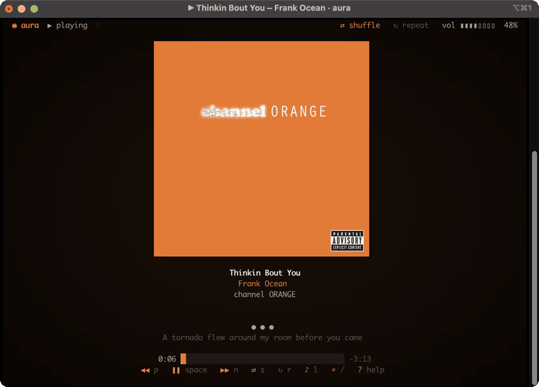
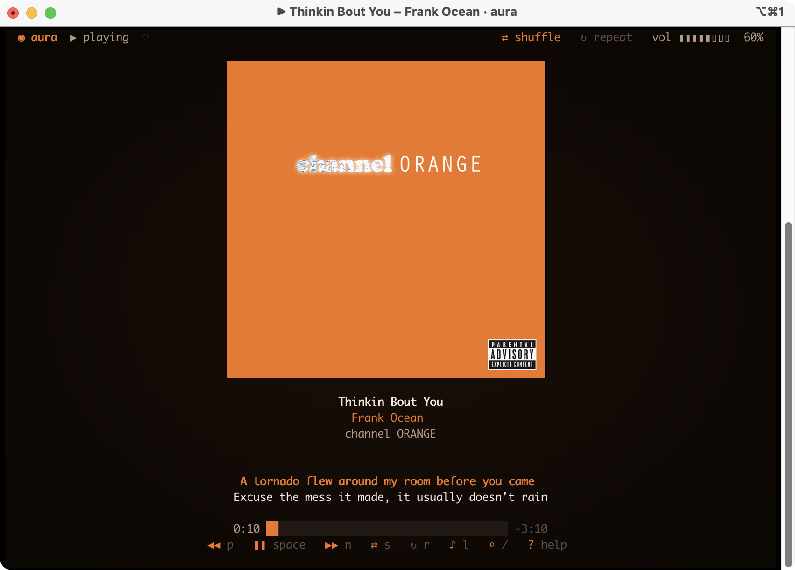
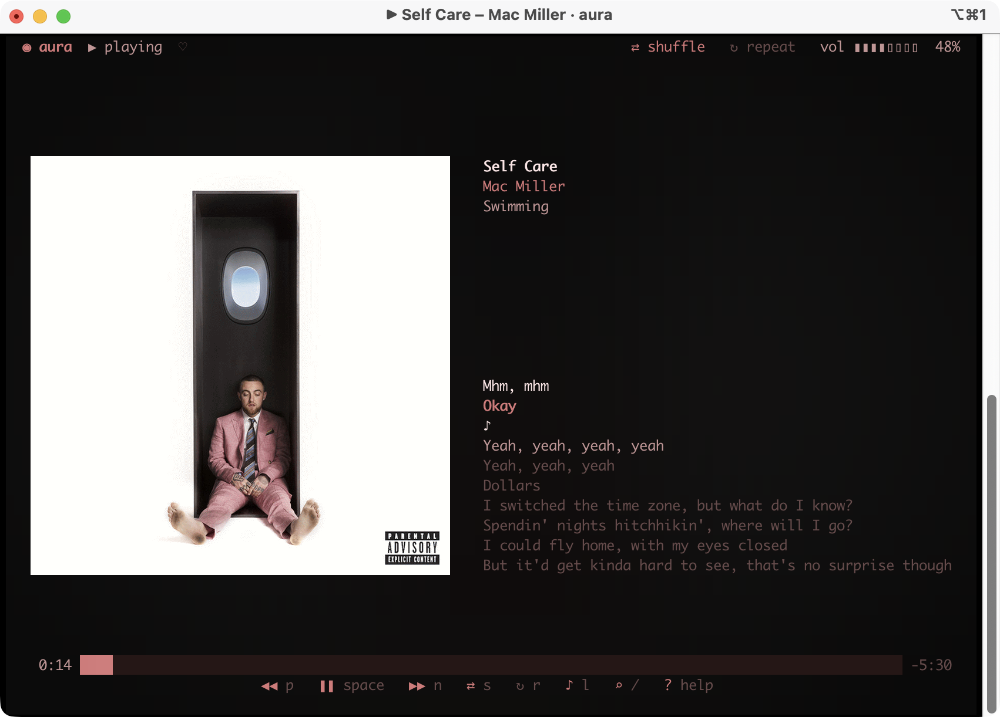
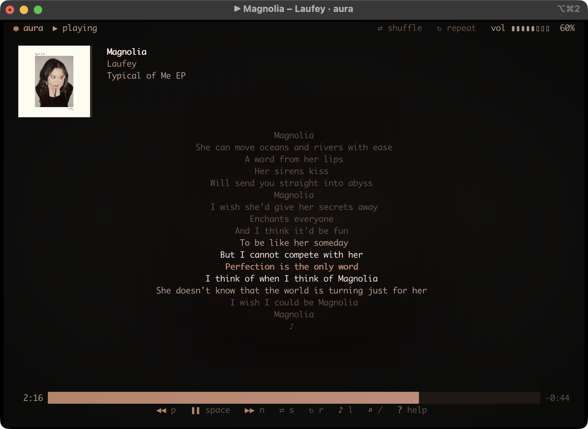
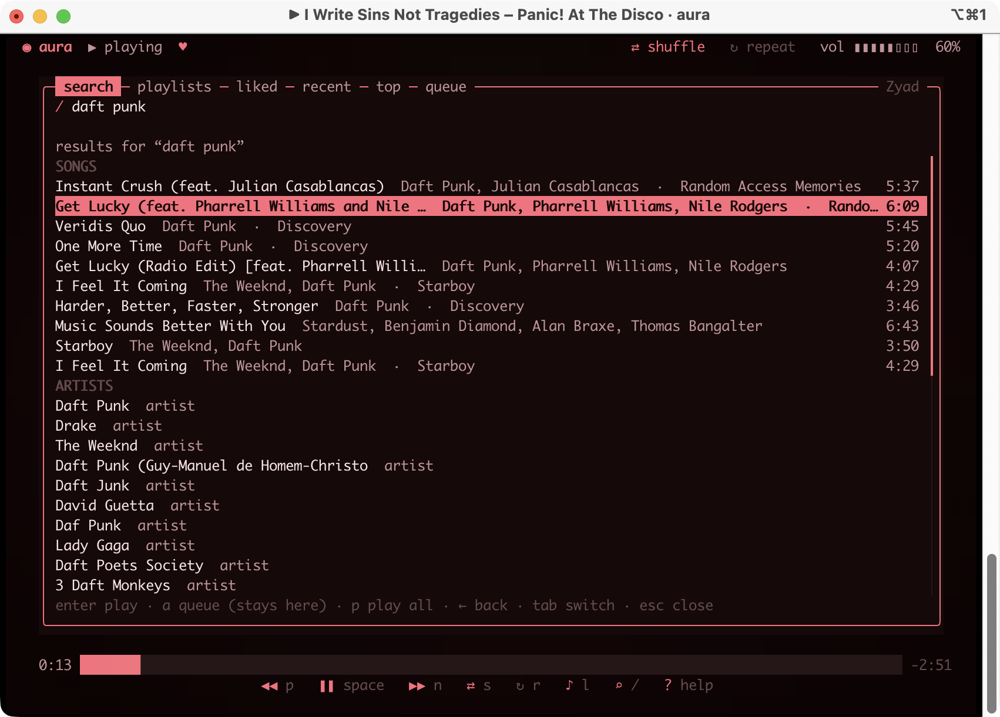
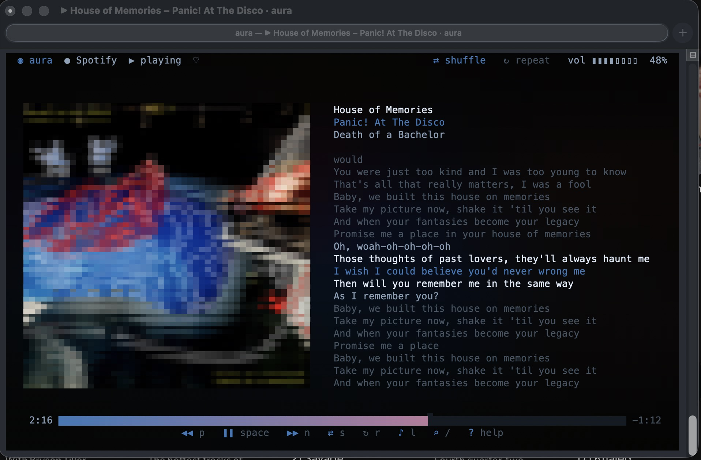

# aura

Spotify, Apple Music, and whatever else is playing, in your terminal. Shows the album cover, picks the colors of the whole UI from it, and shows synced lyrics. You can search and play stuff from it too.

<p align="center">
  
</p>

I made this because every terminal Spotify thing I tried showed a tiny dithered cover and a list. I wanted something that actually looks good on a second monitor.

## What it does

- Real album art if your terminal supports images (iTerm2, Kitty, WezTerm, Ghostty, Sixel). Half-blocks otherwise.
- Every color in the UI comes from the cover. Each song looks different.
- Synced lyrics from [LRCLIB](https://lrclib.net). No API key.
- Reads state straight from the Spotify or Music desktop app, so the display needs no setup, no dev app, no Premium.
- Anything else that shows up in macOS's Now Playing (Tidal, a YouTube tab, VLC...) works too: art, lyrics, play/pause/next/seek. No search for those.
- Search, playlists, liked songs, recents, queue. Playing something never brings the Spotify window forward.
- Four layouts depending on how big the window is, down to a 2-line strip.
- Keyboard and mouse. `aura status` prints JSON if you want it in scripts.

## Screens

| Cover | Split |
| --- | --- |
|  |  |

| Lyrics | Search |
| --- | --- |
|  |  |

Without image support (here the default macOS Terminal) the cover falls back to half-blocks:



## Install

macOS only for now. You need the Spotify app and/or the Music app.

```bash
brew install Zezoo123/tap/aura
```

Or download the binary from the [releases page](https://github.com/Zezoo123/aura/releases/latest), or build it yourself:

```bash
brew install rust
git clone https://github.com/Zezoo123/aura && cd aura
cargo install --path .
```

First run: macOS asks if your terminal can control Spotify. Click Allow. If you clicked Don't Allow, fix it in System Settings → Privacy & Security → Automation.

## Apple Music

Works out of the box. If Music is playing, aura shows it. `x` cycles between players, `--service music` pins it. `/` searches your library. Catalog search isn't possible without a paid Apple developer account, so it's library only.

## Everything else

If some other app is playing (Tidal, Deezer, a browser tab, VLC, whatever reports to the macOS Now Playing widget), aura shows it with cover art looked up from the iTunes catalog, synced lyrics, and play/pause/next/seek/volume. Search, playlists, shuffle, repeat and likes only exist for Spotify and Apple Music. `--service system` pins this mode.

This uses a private macOS framework through osascript. It works on macOS 15.4 through 26 as of this writing, but Apple could close it in an update. If it stops working, Spotify and Apple Music are unaffected.

## Spotify search and playlists

The now-playing screen needs nothing. Search and playlists go through Spotify's Web API, and Spotify makes you create a developer app for that (and requires Premium since Feb 2026). Takes two minutes:

1. Go to the [developer dashboard](https://developer.spotify.com/dashboard) and create an app.
2. Redirect URI: `http://127.0.0.1:8888/callback`
3. Copy the Client ID. Press `/` in aura and paste it, or run `aura login --client-id <ID>`.

Your browser opens once to approve. Tokens live in `~/.config/aura/auth.json`. `aura logout` deletes them.

In the search panel: `enter` plays, `a` queues, `p` plays a whole playlist or album, `←` goes back, `tab` switches sections, `esc` closes.

## Keys

| Key | Action |
| --- | --- |
| `/` | search |
| `tab` | playlists · liked · recent · top · queue |
| `h` | like / unlike |
| `x` | switch player |
| `space` | play / pause |
| `n` `p` | next / previous |
| `←` `→` | seek 5s (shift: 15s) |
| `↑` `↓` | volume |
| `m` | mute |
| `s` `r` | shuffle / repeat |
| `l` | lyrics on/off |
| `[` `]` | nudge lyrics ±250 ms |
| `b` | ambient backdrop on/off |
| `v` | cycle layout (`1` `2` `3` to pick one) |
| `o` | bring the player to front |
| `y` | copy track link |
| `?` | help |
| `q` | quit |

Mouse: click the progress bar to seek, scroll for volume, click the art to play/pause.

## CLI

```bash
aura status              # JSON
aura toggle | play | pause | next | prev
aura seek 92.5
aura volume 40
aura open <spotify uri or link>
aura search daft punk    # needs login
aura playlists           # needs login
aura devices             # needs login
aura --service music next
```

Flags: `--service spotify|music|system`, `--layout cover|split|lyrics`, `--protocol halfblocks|sixel|kitty|iterm2`, `--no-ambient`, `--no-lyrics`, `--lyrics-offset MS`, `--fps N`.

## How it works

Rust, ratatui. State comes from the Spotify and Music apps over their scripting interfaces (one osascript call reads both). A small Swift helper listens for the apps' playback notifications so track changes show up instantly. Art is cached in `~/Library/Caches/aura`, colors come from a k-means pass over the cover, image encoding runs on a worker thread. Spotify search uses the Web API with PKCE, only the endpoints Spotify still allows for new apps.

`AURA_DEBUG=/some/file` logs key presses and slow frames.

## Plans

Next: SoundCloud, then Linux (MPRIS).

## About

I built this with a lot of help from Claude Code. The idea, the design decisions, the testing and the maintenance are mine. Issues and PRs welcome.

MIT.
